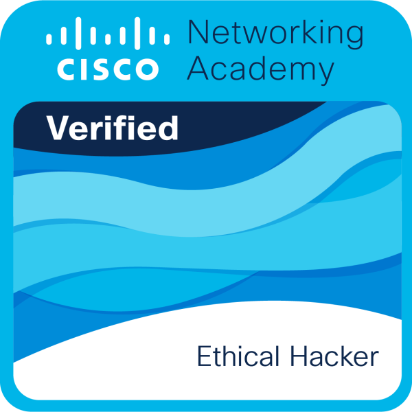
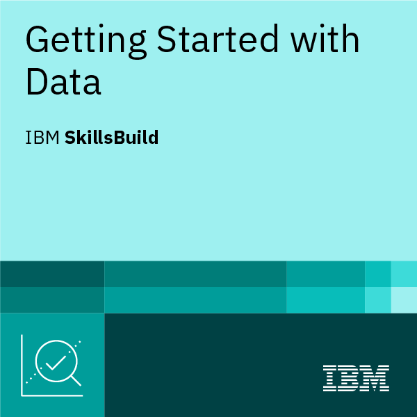
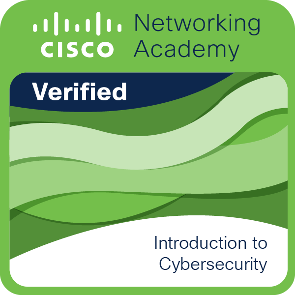
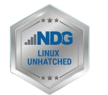

<h1 align="center">🚀 Bienvenue sur mon profil GitHub !</h1>

  
   
  

  
  

---

## 👨‍💻 À propos de moi

Étudiant en deuxième année de BTS CIEL option Informatique et réseaux, passionné d’**informatique**, **d’intelligence artificielle** et **Big Data**.
Je développe sur mon temps libre des projets variés allant du web au hardware, tout en me formant aux nouvelles techs.

- 📅 **Année** : 2ème année - BTS CIEL
- 🎯 **Objectif** : Devenir Ingénieur IA et Big Data 
- 🏆 **Motivation** : Apprendre, partager et innover !
- 💡 *“L’informatique n’est pas qu’une passion, c’est un mode de vie.”*

---

## 💎 Compétences

  
  
  
  
  
  
  
  
  
  
  
  
  
  
  

---

## 📜 Certifications

### Galerie de certifications

<table align="center">
  <tr>
    <td align="center"> <b>Cisco Cyber Threat Management</b></td>
    <td align="center"> <b>Cisco Ethical Hacker</b></td>
    <td align="center"> <b>IBM Getting Started with Data</b></td>
  </tr>
  <tr>
    <td align="center"> <b>Cisco Intro to Cybersecurity</b></td>
    <td align="center"> <b>NDG Linux Unhatched</b></td>
    <td align="center"> <b>NDG Linux Essentials</b></td>
  </tr>
</table>

  <a href="https://www.credly.com/users/elias-cosme-vinou" target="_blank">➡️ Voir mon profil Credly complet</a>

---

## 📫 Me contacter

- 💼 [LinkedIn](https://www.linkedin.com/in/elias-vinou)
- ✉️ **Email :** eliasvinou@gmail.com

---

  
  

